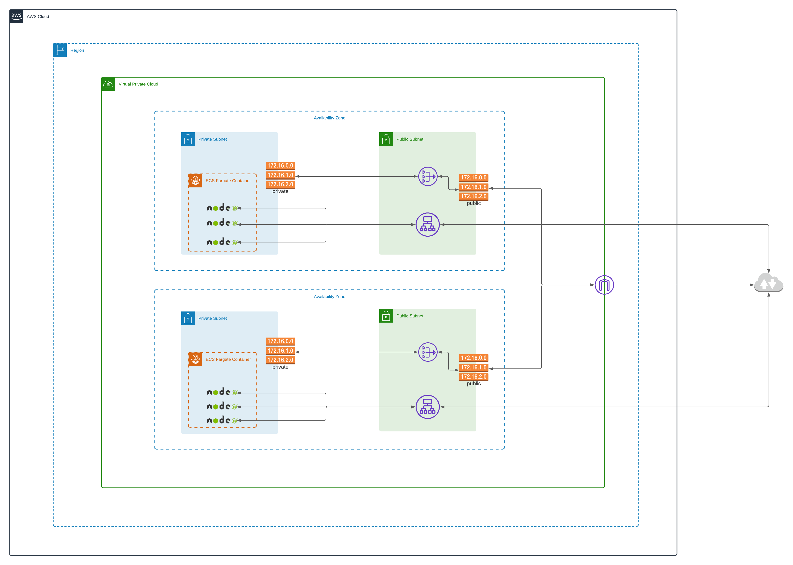

I used this to deploy a dockerized NodeJS Server with WebSocket on AWS with monitoring using CloudWatch Dashboard.

- Elastic Compute Service
- Fargate
- Web Application Firewall
- Virtual Private Cloud
- Application Load Balancer
- Application Auto Scaling
- CloudWatch

# Setup

1. Copy scripts

```
cp template-cloud-deploy.sh cloud-deploy.sh
cp template-publish.sh publish.sh
cp template-cf.yaml cf.yaml
cp template-loadtest.sh loadtest.sh
```

2. Create image repo on ECR.
3. Replace placeholders on `publish.sh`, `cf.yaml`, `cloud-deploy.sh`, and on `cf.yaml`.
4. Run `sh ./publish.sh`.
5. Run `sh ./cloud-deploy.sh`

## Succeeding updates

After the first deployment, uncomment the final lines in `publish.sh` to automatically redeploy ECS Service.

# Load test

1. Replace placeholders on `loadtest.sh`.
2. Run `sh ./loadtest.sh`
